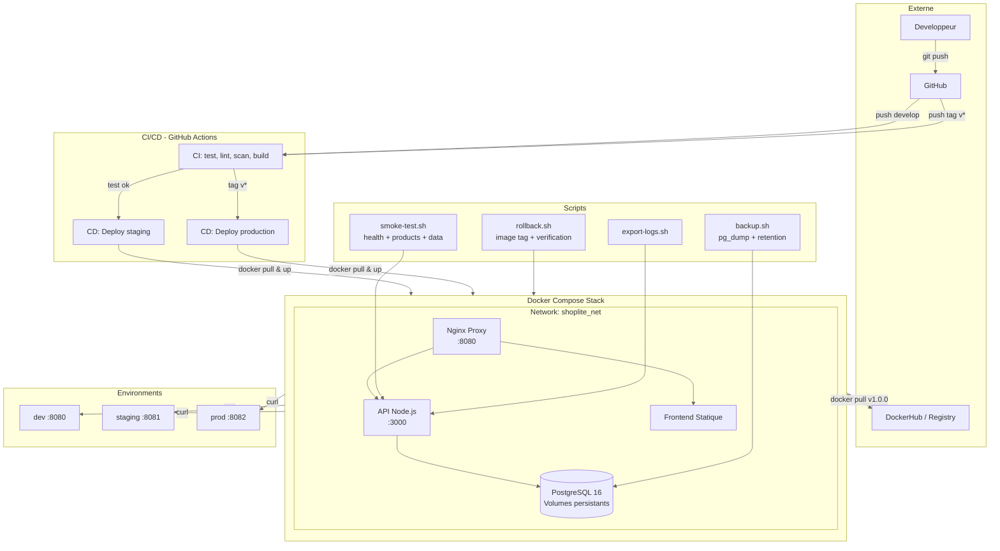

# Architecture

## Diagramme



## Flux de déploiement

```
push develop ──> CI (tests, lint, scan) ──> CD staging ──> smoke test
                                                              │
push tag v1.1.0 ──> CI (tests, lint, scan) ──> CD prod ─────┘
                                                              │
                                                    rollback.sh v1.0.0
                                                         (volumes preserved)
```

## Flux de rollback

```
1. Incident détecté (test /api/products échoue)
2. Exporter logs : sh scripts/export-logs.sh staging
3. Identifier version : docker inspect shoplite_api_staging
4. Vérifier image stable : docker image inspect shoplite-api:v1.0.0
5. Backup DB : sh scripts/backup.sh staging
6. Rollback : sh scripts/rollback.sh staging v1.0.0
   - down (sans -v : volumes préservés)
   - up avec l'image taguée
7. Smoke test + vérification données
8. Communication incident
```

## Services

| Service   | Technologie         | Port  | Volumes          |
|-----------|---------------------|-------|------------------|
| Proxy     | nginx:1.27-alpine   | 8080  | -                |
| API       | Node.js 20 / Express| 3000  | -                |
| Frontend  | HTML/CSS/JS statique| -     | -                |
| Database  | PostgreSQL 16 Alpine| 5432  | shoplite_pgdata  |

## Limites de ressources

| Service   | CPU   | Memory |
|-----------|-------|--------|
| API       | 0.50  | 256M   |
| DB        | 0.50  | 256M   |
| Frontend  | 0.25  | 64M    |
| Proxy     | 0.25  | 64M    |
