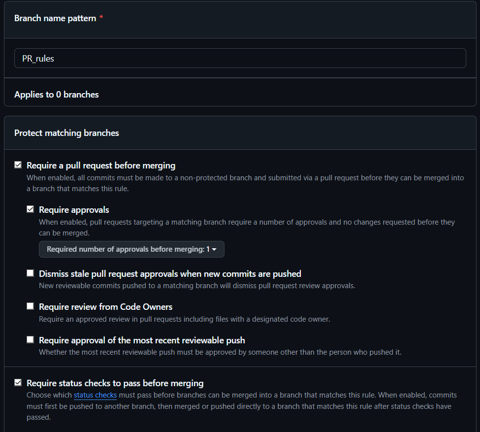

# B 
### 1 
(base) PS C:\Users\MV_pe\OneDrive\Documents\Ynov\B3_(2025-2026)\DevOps\TP_Final\TP-Final-CI-CD-YNOV-B3-> git status                                              
On branch feature/docker-foundation
Your branch is up to date with 'origin/feature/docker-foundation'.

nothing to commit, working tree clean


### 2
(base) PS C:\Users\MV_pe\OneDrive\Documents\Ynov\B3_(2025-2026)\DevOps\TP_Final\TP-Final-CI-CD-YNOV-B3-> git log --oneline --graph --all                         
* d4c8da0 (HEAD -> feature/docker-foundation, origin/feature/docker-foundation) docs:ajout du dossier RENDU.md
* d6048b8 (origin/main, origin/develop, main, develop) Rend les workflows starter valides en manuel
* 98e3348 Remplace CI CD par fichiers starter a completer
* adb1000 Correction workflow CD starter
* 464c880 Ajout starter TP final CI CD ShopLite


### 3 





### 4
```
## Objectif

## Vérifications

- [ ] Tests lancés
- [ ] Docker build OK
- [ ] Smoke test OK

## Risques et rollback


```


### 5 


